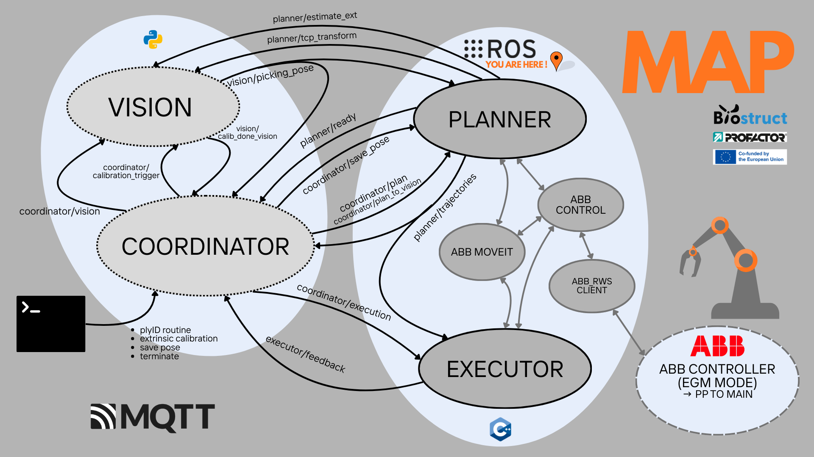

Luca Grigolin at PROFACTOR GmbH 

#   [BIOSTRUCT DRAPING]

This package contains the ros-based Planner and Executor nodes of the Biostruct Draping Software.
In the biostruct_robotics_lab package there is the development version in a non-final drapecell
while in the biostruct_amura package there is the final drapecell version.

## [PLANNER]

The activity of the Planner node is assumed to be supervised by the coordinator node, it has not 
uniquely path-planning functions but it is also responsible for the whole ABB IRB-6700_205_280 
Robot Ros-integration in the software. Its main functions are the following:

- Initialize the system 
- Extrinsic Calibration mode
- Saving a Placing Pose or vision pose to memory
- Path Planning in the draping routine

## [EXECUTOR]

The activity of the Executor node just need a trajectory message to be published in the topic
coordinator/trajectories and a trigger message published in the coordinator/execution topic to
execute the latest published trajectory. It's activity is coordinated with the planner by the 
coordinator.

## [MEMORY]

The memory containing the joint-value poses for the robot routine are for the robotics lab version:

	src/profactor_ros2/biostruct_robotics_lab/memory/memory.yaml

The memory containing the joint-value poses for the robot routine are for the amura scene version:

	src/profactor_ros2/biostruct_amura/memory/memory.yaml

## Launch the whole software 

    cd /BioStruct_Drapebot/coordinator_ws/coordinator_app/launch 

    - python3 launch_stack.py --robot-ip 192.168.125.1 
        (Real Hardware = 192.168.125.1 or Virtual Hardware = 192.168.125.20)

    - python3 launch_stack.py (Fake Hardware)

## [NOTE!]

-	biostruct_robotics_lab uses just a camera mount as tool and no Amura scene, void picking and placing.
    Make sure the tool collision configs are set accordingly.

-   biostruct_amura has both the draping ProPoint gripper and the Amura scene but has not been tested 
    on a real environment yet. Make sure the tool collisions configs are set accordingly.

-   The config for the collision tool is defined at:

		profactor_ros2/abb_irb6700_205_280/abb_irb6700_205_280_support/urdf/abb_irb6700_205_280.xacro

-	The tool_camera frame used in the calibration phase to make the camera always look at the calibration
	board is defined at:

		profactor_ros2/abb_irb6700_205_280/abb_irb6700_205_280_support/urdf/abb_irb6700_205_280_macro.xacro

-	The disable collisions betwen tool_gripper and other links can be configured at:

		profactor_ros2/abb_irb6700_205_280/abb_irb6700_205_280_moveit_config/config/abb_irb6700_205_280.srdf

## [Local Info]

- Ubuntu 24.04.3 LTS
- ROS2 jazzy
- NVIDIA-SMI 580.95.05 
- Driver Version: 580.95.05 
- CUDA Version: 13.0  
- MQTT broker: mosquitto version 2.0.22