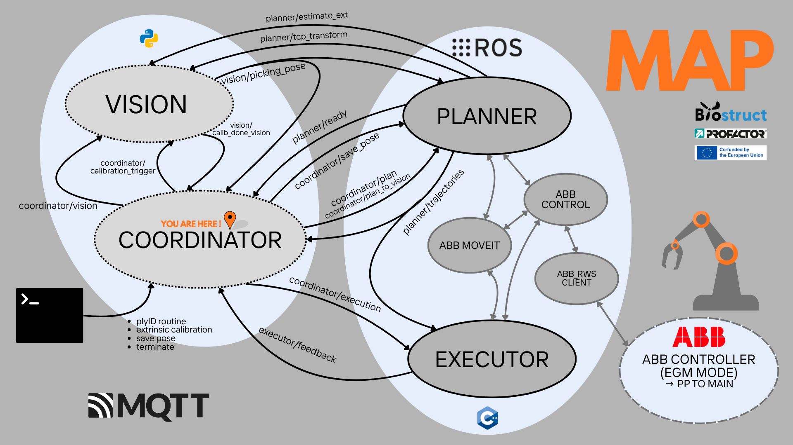

Luca Grigolin at PROFACTOR GmbH 

#  [COORDINATOR] 

This package contains the Coordinator Node for the Biostruct Draping Software and the software launch file.

## Launch the whole software 

    cd /BioStruct_Drapebot/coordinator_ws/coordinator_app/launch 

    - python3 launch_stack.py --robot-ip 192.168.125.1 
        (Real Hardware = 192.168.125.1 or Virtual Hardware = 192.168.125.20)

    - python3 launch_stack.py (Fake Hardware)

## Installation instructions:

Install python environment with all dependencies:

    cd coordinator_app

    python3 -m venv .coordinator_env

    source .coordinator_env/bin/activate   

    pip install --upgrade pip

    pip install -r requirements.txt

## Run just the Coordinator App:

    cd coordinator_app

    source .coordinator_env/bin/activate

    python src/coordinator.py

## [Local Versions]

- Ubuntu 24.04.3 LTS
- ROS2 jazzy
- MQTT broker: mosquitto version 2.0.22
- Python 3.12.3

