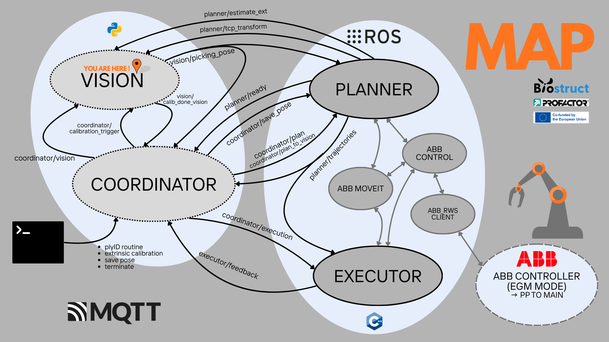

 Luca Grigolin at PROFACTOR GmbH 

#  [VISION]

This package contains the Vision Node for the Biostruct Draping Software.
Implemented in this node there is the Camera-TCP Extrinsic Calibration
algorithm, the ply verification algorithm and finally the 6D pose 
estimation of the plies for the picking phase of the routine.

The camera is assumed to be intrinsically calibrated for the extrinsic 
calibration to work. 
The extrinsic calibration is necessary for the ply verification and 
ply-pose estimation functions.
(A footnote shows the intrinsic calibration that was used)

## Installation instructions:

Install python 3.11 environment with all dependencies:

    cd vision_app

    python3 -m venv .vision_env

    source .vision_env/bin/activate   

    pip install --upgrade pip

    pip install -r requirements.txt

## Run just the vision app:

    cd vision_app

    source .vision_env/bin/activate

    python src/vision_node.py

## Camera: [Genie Nano M2590 Mono]

The spinnaker SDK-4.2.0.88-amd64-22.04, download link below:
https://www.teledynevisionsolutions.com/products/spinnaker-sdk
needs to be installed so that harvesters can get the camera 
output correctly for the vision node. 

(Another way to simply visualize the sensor output is the GigE-V Framework 
for Linux, download link below:
https://www.teledynevisionsolutions.com/landing/dalsa/gige-v-linux-sdk/
Check the detected cameras by the system:

    sudo -E GigeDeviceStatus

software for displaying camera output:

    sudo -E ./DALSA/GigeV/examples/genicam_c_demo/genicam_c_demo

this pkg is not used by the vision node)

## Intrinsics Calibration: [OpenCV Extensions by Alberto Pretto]

Run the calibration:

    cd cv_ext

    ./bin/cam_calib -f ../vision_app/calib/intrinsics/images -c genie_nano_m2590_mono_calib --bw 8 --bh 6 -q 0.02577 -k -s 4 -u --opencv_format
    
    ./bin/cam_calib --help (for more instructions)

Build the app:

    sudo apt install build-essential cmake libboost-filesystem-dev libopencv-dev libomp-dev libceres-dev libyaml-cpp-dev libgtest-dev libeigen3-dev
    
    git clone https://bitbucket.org/alberto_pretto/cv_ext.git
    
    cd cv_ext
    
    git checkout origin/dev --track
    
    git pull

    mkdir build
    
    cd build
    
    cmake -DBUILD_EXAMPLES=ON ..

    make

## AprilTags generation:

    git clone https://github.com/AprilRobotics/apriltag-imgs.git

    cd apriltag-imgs/tag36h11

    convert tag36_11_00023.png -scale 100000% ../../vision_app/data/AprilTags_for_printing/AprilTag23.png

## [Local Versions]

- Ubuntu 24.04.3 LTS
- ROS2 jazzy
- NVIDIA-SMI 580.95.05 
- CUDA Version: 13.0  
- MQTT broker: mosquitto version 2.0.22
- Python 3.12.3